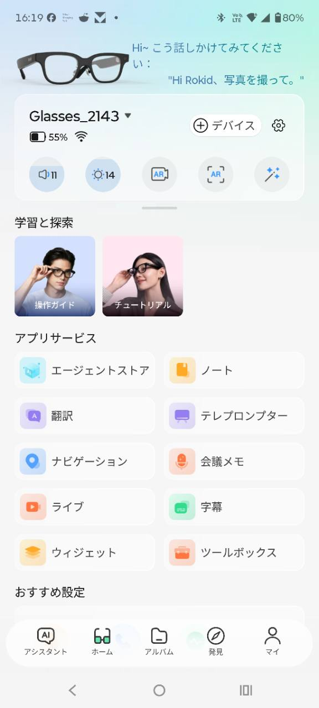
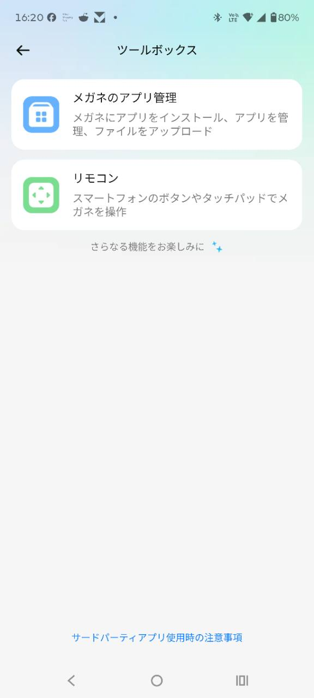

# Photo to Mac

<p align="center"></p>

Rokid AI Glasses RV101で見ている景色を撮影し、その写真をMacへ直接送るアプリです。

**現在のバージョン: 0.5**（同梱の`Photo-to-Mac.apk`）

RokidとMacが同じWi-Fiにつながっていれば、撮った写真がMacの「ピクチャ」フォルダへ入ります。スマートフォンやクラウドサービスは使いません。

## できること

1. Rokidで「Photo to Mac」を開く
2. テンプルを1回タップして撮影する
3. 写真をMacへ自動的に保存する

保存場所は、Macの「ピクチャ」にある`Rokid Inbox`フォルダです。

## 用意するもの

- **Rokid AI Glasses RV101**
- **Mac**
- **MacとRokidを接続するWi-Fi**
- **Rokidの開発用5ピンケーブル**
  充電用ケーブルとは別の開発用ケーブルです。最初にアプリを入れるときだけ使用します。
- **Homebrew**（Mac用のソフト導入ツール）
  必要なソフトがMacに入っていない場合だけ使用します。[公式サイト](https://brew.sh/ja/)から導入できます。
- **Rokidのスマホアプリ側で開発者モード（ADB）を有効にしておくこと**
  開発用5ピンケーブルをつなぐだけではADBは有効になりません。最初の準備の前に有効にしてください。

初回のみ、Macとの接続に必要なソフトを自動で準備します。ダウンロードに数分かかる場合があります。

## 最初の準備

### 1. Photo to MacをMacへダウンロードする

[Photo to Macの最新版をダウンロード](https://github.com/ksuzukigh/rokid-photo-to-mac/releases/latest/download/Photo-to-Mac.zip)します。ダウンロードした`Photo-to-Mac.zip`をダブルクリックすると、Photo to Macのフォルダが開きます。

### 2. Macを写真の受取先にする

1. `Mac受信機を設定.command`をダブルクリックします。
2. 「Macの写真受信機を設定しました」と表示されたら、Enterキーを押します。

設定後は、Macへログインすると写真の受信機が自動で動きます。

### 3. Rokidの開発者モードを有効にする

スマートフォンのRokidアプリ側で、開発者モード（ADB）を有効にします。

### 4. Rokidへアプリを入れる

1. Rokidを開発用5ピンケーブルでMacへつなぎます。
2. `Rokidへアプリを入れる.command`をダブルクリックします。
3. RokidにUSB接続の確認が出た場合は許可します。
4. 「インストールが完了しました」と表示されたら準備完了です。

以前の版を使っていた場合も、`Mac受信機を設定.command`と`Rokidへアプリを入れる.command`をこの順でもう一度実行してください。

<details>
<summary>Macに止められた場合</summary>

「Appleは、このファイルにMacに損害を与えたり、プライバシーを侵害する可能性のあるマルウェアが含まれていないことを検証できませんでした」と表示された場合は、次のように許可します。

1. 警告画面では「ゴミ箱に入れる」を押さず、「完了」を押します。
2. Macの「システム設定」を開きます。
3. 左側の「プライバシーとセキュリティ」を選び、下へスクロールします。
4. 「セキュリティ」に表示されたファイルの「開く」を押します。
5. 確認画面で「このまま開く」を押し、Macのログインパスワードを入力します。

3つの`.command`ファイルは、それぞれ初回に許可を求められる場合があります。

許可ボタンは、ファイルを開こうとしてから約1時間表示されます。詳しくは[Apple公式の説明](https://support.apple.com/ja-jp/guide/mac-help/mh40617/mac)を参照してください。

ターミナルに「プロセスが完了しました」と出たら設定は終了しています。ウィンドウ左上の赤いボタン、または`command + W`で閉じてください。

</details>

<details>
<summary>Macにローカルネットワークの許可を求められた場合</summary>

初めて写真を送るときに、「`python3.13`がローカルネットワーク上のデバイスを見つけることを許可しますか？」と表示されることがあります。数字部分はMacによって異なります。

<p align="center"></p>

「許可」を押してください。

誤って「許可しない」を押した場合は、Macの「システム設定」→「プライバシーとセキュリティ」→「ローカルネットワーク」を開き、表示された`python3`の項目をオンにします。

</details>

## 普段の使い方

1. MacとRokidを同じWi-Fiへつなぎます。
2. Rokidのアプリ一覧から「Photo to Mac」を開きます。
3. テンプルを1回タップします。
4. 「Macに保存しました」と表示されたら、Macの「ピクチャ」→「Rokid Inbox」を開きます。

普段は開発用5ピンケーブルをつなぐ必要はありません。

送れなかった写真はRokidへ一時保存され、次に送信できたときに自動でMacへ送られます。保存できるのは最大30枚です。1回の撮影後に送る未送信写真は最大5枚で、残りはその後の撮影時に送られます。

<details>
<summary>RokidのWi-Fiが切れていた場合</summary>

1. 「Photo to Mac」を開き、テンプルを1回タップします。
2. Wi-Fi設定画面が開いたら、右テンプルを1回タップしてWi-Fiをオンにします。
3. Wi-Fiへ接続されるまで少し待ちます。
4. テンプルを素早く2回タップしてHomeへ戻ります。
5. もう一度「Photo to Mac」を開き、撮影します。

初めて使うWi-Fiでは、先にRokidのWi-Fi設定でネットワーク名とパスワードを登録してください。

アプリを開くだけでWi-Fiを戻したい場合は、別公開の[Wi-Fi ON](https://github.com/ksuzukigh/rokid-wifi-on)を利用できます。

</details>

## 送れないとき

- MacとRokidが同じWi-Fiにつながっているか確認します。
- Macへログインしていることを確認します。
- `Mac受信機を設定.command`をもう一度実行します。
- RokidのWi-Fiがオフの場合は、上の「RokidのWi-Fiが切れていた場合」を試します。
- ホテルやカフェなどのWi-Fiでは、機器同士の通信が禁止されていて使えない場合があります。
- Macの「システム設定」→「ネットワーク」→「ファイアウォール」で、「外部からの接続をすべてブロック」がオフになっていることを確認します。

送信に失敗した写真はRokidに残り、次回送信できたときに自動で送られます。

## 削除するには

1. Macで`Mac受信機を停止.command`をダブルクリックします。
2. スマートフォンでRokidアプリを開きます。
3. 「ホーム」→「ツールボックス」→「メガネのアプリ管理」の順に開きます。
4. 「Photo to Mac」の右側にある丸い「－」ボタンを押し、画面の案内に従って削除します。





※ Rokidアプリの更新で、画面や名前が少し変わることがあります。

Macの「ピクチャ」→「Rokid Inbox」に保存済みの写真は削除されません。Rokidに残っている未送信の写真は、アプリを削除すると一緒に削除されます。

## 注意

- 自宅など、信頼できるWi-Fiでお使いください。
- カフェ、ホテル、社内など、ほかの人と共用するWi-Fiでは使用しないでください。
- Macの写真受信機は、`Mac受信機を停止.command`を実行するまで、Macへのログイン時に自動で起動します。
- Rokid AI Glasses RV101用です。

## 関連アプリ

- [Wi-Fi ON](https://github.com/ksuzukigh/rokid-wifi-on)：Rokid AI Glasses RV101のWi-Fiを復旧します。
- [Rokid Control](https://github.com/ksuzukigh/rokid-mac-control)：Rokid AI Glasses RV101の画面をMacに表示し、Macから操作します。

<details>
<summary>開発者向けの詳しい情報</summary>

### Androidアプリを自分で作り直す場合

JDK 17、Android SDK、ADBが必要です。

```bash
export JAVA_HOME=/opt/homebrew/opt/openjdk@17/libexec/openjdk.jdk/Contents/Home
export ANDROID_SDK_ROOT=/opt/homebrew/share/android-commandlinetools
keytool -genkeypair -v -keystore ~/rokid-release.jks -alias rokid \
  -keyalg RSA -keysize 2048 -validity 10000

export ROKID_STORE_PASSWORD='配布用の鍵を作ったときのパスワード'
export ROKID_KEY_PASSWORD="$ROKID_STORE_PASSWORD"
./gradlew assembleRelease
cp app/build/outputs/apk/release/app-release.apk Photo-to-Mac.apk
```

`rokid-release.jks`とパスワードはリポジトリへ追加せず、安全な場所へバックアップしてください。どちらかを失うと、同じ署名の更新版を配布できなくなります。

アプリはUDP 8766番ポートで初回設定済みのMac受信機を探し、写真をTCP 8765番ポートへ送ります。固定IPアドレスは保存しません。

ブロードキャストで受信機が見つからない場合は、同じ`/24`ネットワーク内の最大254アドレスへ認証付きの問い合わせを送ります。会社など、これより広いネットワークでは予備探索を行いません。

</details>

<details>
<summary>変更履歴</summary>

- **0.5**（2026-07-28）— 受信先と写真送信の安全性、カメラ解放、未送信写真の上限を改善
- **0.4**（2026-07-27）— 送れなかった写真の保存と再送、撮影停止からの復帰、セットアップ案内を改善
- **0.3**（2026-07-27）— Mac受信機の停止機能と正式署名APKへ移行
- **0.2**（2026-07-22）— Wi-Fi復帰案内と撮影前の説明を改善

</details>

## ライセンス

MIT License（詳細は[LICENSE](LICENSE)を参照）
