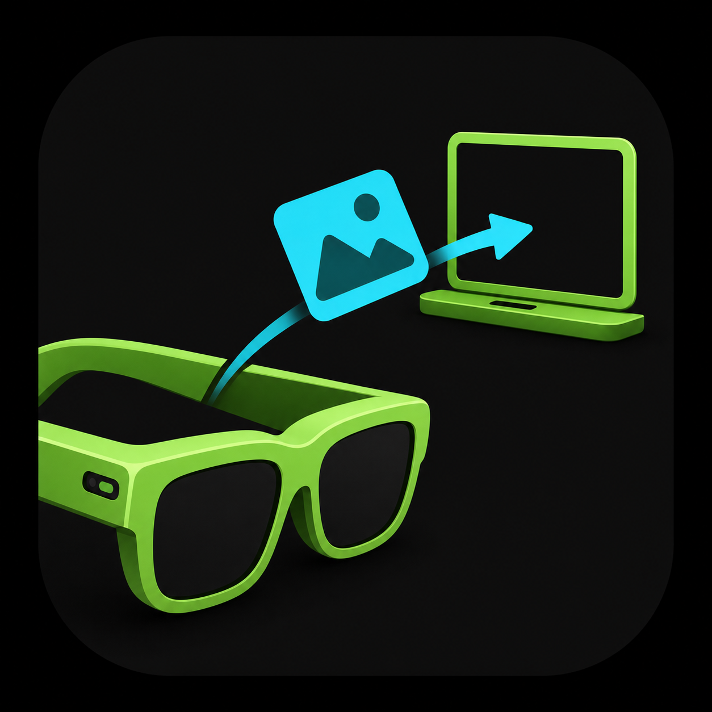
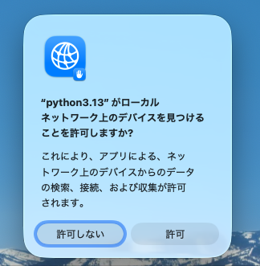

# Photo to Mac for Rokid Glasses

<p align="center"></p>

Rokid Glassesで見ている景色を撮影し、その写真をMacへ直接送るアプリです。

スマートフォンやクラウドサービスは使いません。RokidとMacが同じWi-Fiにつながっていれば、撮った写真がMacの「ピクチャ」フォルダへ入ります。

## できること

1. Rokidで「Photo to Mac」を開く
2. テンプルを1回タップして撮影する
3. 写真がMacへ自動的に保存される

保存場所は、Macの「ピクチャ」にある`Rokid Inbox`フォルダです。

## 用意するもの

- Rokid Glasses RV101
- Mac
- Rokidの開発用5ピンケーブル（最初にアプリを入れるときだけ使用）
- MacとRokidを接続するWi-Fi
- Mac用の無料ツール「Homebrew」（入っていない場合は[公式サイト](https://brew.sh/ja/)から導入）

## 最初の準備

### 1. この一式をMacへ保存する

GitHub画面上部の緑色の「Code」ボタンを押し、「Download ZIP」を選びます。ダウンロードしたZIPファイルをダブルクリックして開いてください。

### 2. Macを写真の受取先にする

展開したフォルダにある`Mac受信機を設定.command`をダブルクリックします。

Terminalに「Macの写真受信機を設定しました」と表示されたら、Enterキーを押して処理を終了します。

設定時に、このMacとRokidだけが写真をやり取りするための合言葉が自動で作られます。設定後はMacへログインするたびに受信機が自動で動きます。

### 3. Rokidへアプリを入れる

1. Rokidを開発用5ピンケーブルでMacへつなぎます。
2. `Rokidへアプリを入れる.command`をダブルクリックします。
3. RokidにUSB接続の確認が出た場合は許可します。
4. 「インストールが完了しました」と表示されたら準備完了です。

この操作でアプリのインストールと同時に、Mac側で作った合言葉がRokidへ安全に渡されます。以前の版を使用していた場合も、`Mac受信機を設定.command`と`Rokidへアプリを入れる.command`をこの順でもう一度実行してください。

### macOSに止められたとき（3つのファイルに共通）

ダウンロードした3つの`.command`ファイルは、**それぞれ初回に1回ずつ**macOSの許可が必要になる場合があります。

「Appleは、Macに損害を与えたり、プライバシーを侵害する可能性のあるマルウェアが含まれていないことを検証できませんでした」と表示されたら、次の手順で、そのとき開こうとしたファイルを許可します。

1. 「ゴミ箱に入れる」は押さず、「完了」を押します。
2. Macのメニューから「システム設定」を開きます。
3. 左側の「プライバシーとセキュリティ」を選び、下へスクロールします。
4. 「セキュリティ」に表示されたファイルの「開く」を押します。
5. 確認画面で「このまま開く」を押し、Macのログインパスワードを入力します。

まず`Mac受信機を設定.command`でこの操作を行い、次に`Rokidへアプリを入れる.command`でも警告が出た場合は、同じ操作をもう一度行います。`Mac受信機を停止.command`を初めて使うときも同様です。

許可ボタンは、ファイルを開こうとしてから約1時間表示されます。詳しくは[Apple公式の説明](https://support.apple.com/ja-jp/guide/mac-help/mh40617/mac)を参照してください。

処理後に「プロセスが完了しました」と表示されてもTerminalのウィンドウが残る場合は、左上の赤い閉じるボタン、または`⌘W`で閉じてください。

## 普段の使い方

1. MacとRokidを同じWi-Fiへつなぎます。
2. Rokidのアプリ一覧から「Photo to Mac」を開きます。
3. テンプルを1回タップします。
4. 「Macに保存しました」と表示されたら、Macの「ピクチャ」→「Rokid Inbox」を開きます。

普段は開発用ケーブルをつなぐ必要はありません。

### 写真の受信を止める

外出先などで写真の受信機を動かしたくないときは、`Mac受信機を停止.command`をダブルクリックします。受信機の自動起動も停止しますが、「ピクチャ」→「Rokid Inbox」に保存済みの写真は削除されません。

もう一度使うときは、`Mac受信機を設定.command`を実行してください。以前と同じ合言葉を引き続き使うため、Rokidへアプリを入れ直す必要はありません。

### 初めて写真を送るときのMac側の許可

初回の写真送信時に、Macへ「`python3.13`がローカルネットワーク上のデバイスを見つけることを許可しますか？」という画面が出ることがあります。数字部分はMacの環境によって変わります。

<p align="center"></p>

ここでは**「許可」**を押してください。これは、Macの写真受信機が同じWi-Fi上のRokidを見つけ、写真を受け取るために必要です。インターネット上へ写真を公開する許可ではありません。

誤って「許可しない」を押した場合は、Macのメニューから「システム設定」→「プライバシーとセキュリティ」→「ローカルネットワーク」を開き、表示された`python3`の項目をオンにします。詳しくは[Apple公式の説明](https://support.apple.com/ja-jp/guide/mac-help/mchla4f49138/mac)を参照してください。

## RokidのWi-Fiが切れていたとき

Macから操作する別のツールがなくても、Rokid単体でWi-Fiを戻せます。

1. 「Photo to Mac」を開き、いつもどおりテンプルを1回タップします。
2. Wi-Fiがオフの場合は、アプリがRokidのWi-Fi設定画面を自動で開きます。
3. Wi-Fiの行が選ばれているので、右テンプルを1回タップしてオンにします。
4. 以前使ったWi-Fiへ接続されるまで少し待ちます。
5. テンプルを素早く2回タップしてHomeへ戻ります。
6. もう一度「Photo to Mac」を開き、撮影します。

この操作は、Rokidの正式なWi-Fi設定を使います。一時的に無理やりオンにする方式ではないため、あとから勝手にオフへ戻りにくくなります。

まだ一度も使ったことがないWi-Fiへ接続する場合は、先にRokid本体のWi-Fi設定でネットワーク名とパスワードを登録してください。

なお、別公開の[Mac操作ツール](https://github.com/ksuzukigh/rokid-mac-control)を使用中は、Wi-Fiがオフになったときの自動復旧も利用できます。ただし、この写真転送アプリだけでも上記の手順で使用できます。

より簡単に、アプリを開くだけでWi-Fiを戻したい場合は、別公開の[Wi-Fi ON](https://github.com/ksuzukigh/rokid-wifi-on)を利用できます。Wi-Fi ONを入れなくても、Photo to Mac自身の「設定画面＋テンプル1回」の復旧機能はそのまま使えます。

## 送れないとき

- MacとRokidが同じWi-Fiにつながっているか確認します。
- Macを再起動した直後は、ログインが完了していることを確認します。
- RokidのWi-Fiがオフの場合は、上の「RokidのWi-Fiが切れていたとき」の手順を試します。
- ホテルやカフェなどのWi-Fiでは、機器同士の通信が禁止されていて使えない場合があります。

## 安全上の注意

MacとRokidは、初回設定時に作る専用の合言葉で互いを確認します。合言葉が一致しない機器からの写真は受け取らず、合言葉を証明できないMacへ写真を送りません。

写真は同じWi-Fi内を暗号化されていないHTTPで転送します。通信内容を保護するため、自宅など信頼できるWi-Fiの中で使用し、外出先では`Mac受信機を停止.command`で停止してください。

## 対応状況

Rokid Glasses RV101の実機で、撮影・Macへの転送・Wi-Fi復帰・アイコン表示を確認しています。他のRokid製品での動作は未確認です。

<details>
<summary>開発者向け情報</summary>

### Androidアプリを自分で作り直す場合

JDK 17、Android SDK、ADBが必要です。

```bash
export JAVA_HOME=/opt/homebrew/opt/openjdk@17/libexec/openjdk.jdk/Contents/Home
export ANDROID_SDK_ROOT=/opt/homebrew/share/android-commandlinetools
keytool -genkeypair -v -keystore ~/rokid-release.jks -alias rokid \
  -keyalg RSA -keysize 2048 -validity 10000

export ROKID_STORE_PASSWORD='配布用の鍵を作ったときのパスワード'
export ROKID_KEY_PASSWORD="$ROKID_STORE_PASSWORD"
./gradlew assembleRelease
cp app/build/outputs/apk/release/app-release.apk Photo-to-Mac.apk
```

`rokid-release.jks`とパスワードはリポジトリへ追加せず、安全な場所へバックアップしてください。どちらかを失うと、同じ署名の更新版を配布できなくなります。

アプリはUDP 8766番ポートで合言葉が一致するMacの受信機を探し、写真をTCP 8765番ポートへ送ります。固定IPアドレスは保存しません。

</details>
